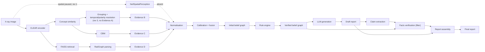

# Project Architecture — Evidence-Based Radiology Report Generation (v1)

**Source of truth:** [`docs/pipeline.md`](./pipeline.md) (rev 2). This document translates that specification into implementable modules, package boundaries, and interface contracts. It does not re-derive or re-decide anything `pipeline.md` already settled — where this doc makes a *new* choice not covered there (language, framework, storage backend), it's called out explicitly as an architecture-level decision, not a pipeline-semantics one.

**Status:** Architecture only. No implementation. Code blocks below are interface signatures (types, function/method signatures, docstrings) — bodies are `...` or `raise NotImplementedError`, not logic.

**v1 scope, inherited from `pipeline.md`'s Revision Log:**
- **No verification loop.** Stage 3 is `N27 → N29 → N30 → N31`, single pass. `N32` (regenerate) is a Phase 2 stub only.
- **N02 (spatial perception) is paused.** Evidence A is absent by design, not by failure. This is treated as a first-class architectural case, not a special case bolted on later — see §5.2.

---

## 0. Assumptions declared at the architecture layer

`pipeline.md` doesn't mandate a language or stack; the following are this document's choices, made explicit so they can be challenged:

| Decision | Choice | Why |
|---|---|---|
| Language | Python 3.11+ | Every named dependency in `pipeline.md` (FAISS, RadGraph, a CLEAR-style encoder, an LLM SDK, scientific NLP for RadLex matching) is Python-native or Python-first |
| Data contracts | `dataclasses` (stdlib) for internal/in-process types; note where `pydantic` is a reasonable drop-in if runtime (de)serialization validation is wanted at a boundary (e.g. `FinalReport`, persisted artifacts) | Keeps the interface layer dependency-light; upgrading a specific type to `pydantic` later doesn't change its call sites |
| Behavioral interfaces | `typing.Protocol` (structural typing) over `abc.ABC` where a component has swappable implementations (spatial perception, LLM provider) | Swapping `NullSpatialPerception` → a real model in Phase 2 requires no inheritance from a base class, just a structurally-compatible object |
| Orchestration | Plain sequential composition (a `Pipeline` object calling stage functions in order) — **not** a DAG/workflow engine (Airflow/Prefect/etc.) | v1 has no loop and no branching-at-runtime; Stage 1's four sub-branches are independent but the whole thing is still one linear per-study call. A workflow engine is unjustified complexity until Phase 2's loop or a batch/distributed requirement appears — flagged as a §11 open decision if that changes |
| Package name | `rrg` (top-level `src/rrg/`) | Placeholder — rename freely; used for path consistency below |

---

## 1. Architectural principles carried over from `pipeline.md`

These are enforced by the module boundaries below, not just documented:

1. **Offline/online split is a hard module boundary, not a runtime flag.** Everything `pipeline.md` marks "must be precomputed offline" (concept bank embeddings + tags, FAISS index, RadGraph over the reference corpus, canonical vocabulary) lives in `rrg/offline/`, imports nothing from the per-study runtime path, and is invoked by a separate build CLI — never importable into a per-request code path by accident.
2. **The verified belief graph is a trust boundary.** Everything in `rrg/reporting/` (Stage 3) receives only a `VerifiedBeliefGraph` plus fixed style config — never raw evidence, never raw retrieved text. This is enforced at the interface level: Stage 3 modules' function signatures simply don't accept Stage 1 types.
3. **Evidence A's absence is a first-class input state, not an error state — for the one interface that still consumes it.** Fusion (`fusion.calibration_fusion`, §6.2) takes `Optional[EvidenceA]` / `EvidenceA | None`, and `None` is a fully specified, tested code path — not a `try/except` fallback. **[Rev 3]** `concepts.grouping` (§5.4, replacing `concepts.refinement`) does **not** take Evidence A as an input at all, even once N02 exists — see `pipeline.md`'s Revision Log rev 3. Evidence A's only remaining consumer is fusion.
4. **Every module boundary is a typed data contract, not a shared mutable object.** Modules communicate through the dataclasses in `rrg/core/types.py`; nothing reaches into another module's internals.
5. **Determinism boundary matches `pipeline.md` INV-4.** Everything up to and including `VerifiedBeliefGraph` must be a pure function of (input image, pinned model/asset versions) — this is why offline asset builders are versioned and why the fusion/rule-engine modules below take no wall-clock-dependent or random state.

---

## 2. Repository layout

```
src/rrg/
  core/
    types.py            # Finding, EvidenceRef, BeliefGraph, ClaimDecisions, FinalReport, StudyMeta, enums
    vocab.py             # CanonicalVocabulary + per-source mapping tables (resolves GAP-6)
    config.py             # Settings: nested per-module config, loaded from YAML/env
    versioning.py          # VersionManifest + startup compatibility check (§7.1 of pipeline.md)
    errors.py               # Exception hierarchy, one class per pipeline.md error code
    artifact_store.py        # Persistence interface (§7.3 of pipeline.md)

  ingest/
    image_loader.py      # N01

  perception/
    spatial/
      interface.py        # SpatialPerceptionProvider Protocol (N02) — the pluggable seam
      null_provider.py     # NullSpatialPerception — v1 default, Evidence A absent
      region_laterality.py  # N04 — post-processing; only exercised once a real provider exists
    clear_encoder.py      # N03 → N05

  concepts/
    bank.py               # N08 resource loader (embeddings + tag sidecar, read-only at runtime)
    similarity.py          # N07 → N10
    grouping.py             # N12/N16/N19 → Evidence B (N21) [rev 3: replaces refinement.py — no Evidence A input, ever]
    tagging/                 # offline-only: builds bank.py's sidecar table (§4.6 rev 3 steps 1-8)
      laterality.py           # regex/gazetteer laterality tagger (§4.4, unchanged)
      polarity.py               # negation-cue base polarity + temporal-language classification + resolved_polarity combination (§4.6 steps 4-6)
      finding_vocab.py           # canonical finding vocabulary from RadGraph observation entities + CheXpert anchors (§4.6 step 7 — NOT RadLex, see rationale there)
    cbm/
      concept_filter.py    # N13
      cbm_head.py           # N17 → Evidence C (N20)

  retrieval/
    faiss_index.py         # N09 (query-time interface; index itself built offline)
    radgraph_parser.py       # shared RadGraph wrapper — used online here (N15 query-time) and by Stage 3 (N29) and offline (corpus precompute)
    evidence_d.py             # N11 join + N18 aggregation

  fusion/
    normalisation.py         # N22
    calibration_fusion.py      # N23
    belief_graph.py             # N24
    rules/
      rule_engine.py            # N25 — hand-curated rule table + evaluator (resolves GAP-8, rev 2)
      radlex_client.py           # BioPortal-backed RadLex lookup (anatomy hierarchy, term resolution)

  reporting/
    llm_generation.py         # N27 → N28
    facts_verification.py       # N30 (v1: filter, not gate)
    report_assembly.py           # N31 (v1: deterministic span edit)
    regenerate.py                 # N32 — Phase 2 interface stub only, not implemented

  orchestration/
    context.py                 # PipelineContext threaded through one study's run
    pipeline.py                  # Pipeline.run(): the linear v1 composition

  offline/
    build_radlex_snapshot.py     # parses the downloaded RadLex.owl once into a compact local snapshot (class id, label, synonyms, is-a parents, part-of family) — feeds fusion.rules.radlex_client AND concepts.tagging's anatomy step
    build_canonical_vocab.py       # GAP-6 canonical vocab + 4 source→canonical mapping tables (the B-relevant finding slice is built in build_concept_bank.py's tagging pass, §4.6 step 7 — this module covers the rest: A/C/D mappings, GAP-6 broadly)
    build_concept_bank.py            # N08: embeddings + the full tagging pipeline (pipeline.md §4.6 rev 3, steps 1-8) — anatomy, laterality, resolved_polarity, temporal_class, canonical_finding, group_key
    build_faiss_index.py               # N09 resource build, with patient-level exclusion baked in
    precompute_radgraph_corpus.py       # N15 offline half: RadGraph over the whole reference corpus

  evaluation/
    metrics.py                  # §7.4 metrics: coverage/omission rate, claim removal rate, etc.
    harness.py                    # runs Pipeline over a labelled set, computes metrics

tests/
  fixtures/                    # known-answer studies per pipeline.md §9 build order
  unit/                         # one test module per rrg/ module above
  integration/                   # Stage-1-only, Stage-2-only, full-pipeline fixture runs
```

Module → `pipeline.md` node cross-reference is kept in the comments above and repeated in §9's table — use that table as the canonical lookup when a file's purpose isn't obvious from its name.

---

## 3. Shared core layer (`rrg/core/`)

Everything else depends on this layer; it depends on nothing else in `rrg/`.

### 3.1 `core/types.py` — data contracts

Directly implements `pipeline.md` §3.2, plus the v1 (rev 1) additions from §6.

```python
from dataclasses import dataclass, field
from enum import Enum
from typing import Optional

class Laterality(str, Enum):
    LEFT = "left"
    RIGHT = "right"
    BILATERAL = "bilateral"
    MIDLINE = "midline"
    UNSPECIFIED = "unspecified"

class Polarity(str, Enum):
    PRESENT = "present"
    ABSENT = "absent"
    UNCERTAIN = "uncertain"

class EvidenceSource(str, Enum):
    A = "A"  # spatial — absent in v1, see §5.2
    B = "B"  # refined 368k concepts
    C = "C"  # CBM pathology predictions
    D = "D"  # retrieved RadGraph facts

AnatomyID = str    # canonical zone id, resolved against the RadLex-backed atlas (§6.4 below)
ConceptID = int    # index into the 368k concept bank, 0..368293

@dataclass(frozen=True)
class StudyMeta:
    study_uid: str
    series_uid: str
    view_position: str                 # "PA" | "AP" | "LATERAL"
    patient_orientation: Optional[str]
    pixel_spacing: Optional[tuple[float, float]]
    acquisition_datetime: Optional[str]
    is_inverted: bool
    spatial_unavailable: bool = True   # v1 default: N02 paused — see §5.2
    laterality_unreliable: bool = False

@dataclass(frozen=True)
class EvidenceRef:
    source: EvidenceSource
    raw_score: float
    norm_score: Optional[float] = None   # populated post-N22
    provenance: dict = field(default_factory=dict)

@dataclass(frozen=True)
class Finding:
    finding_id: str
    label: str                          # canonical vocabulary term (rrg.core.vocab)
    anatomy: Optional[AnatomyID]
    laterality: Laterality
    attributes: dict[str, str]
    polarity: Polarity
    confidence: float
    support: list[EvidenceRef]

@dataclass(frozen=True)
class Relation:
    kind: str                           # "located_at" | "has_attribute" | "suggests" | "contradicts"
    source_finding_id: str
    target_id: str                      # finding_id, or an AnatomyID/Attribute id depending on kind

@dataclass(frozen=True)
class RuleApplication:
    rule_id: str
    rule_version: str
    targets: list[str]                  # finding_id(s) affected
    action: str                         # "drop" | "downweight" | "collapse" | "resolve_conflict"
    before: dict
    after: dict
    rationale: str

@dataclass
class BeliefGraph:
    findings: list[Finding]
    relations: list[Relation]
    study_meta: StudyMeta
    graph_version: str                  # "initial" | "verified"
    audit: list[RuleApplication] = field(default_factory=list)
    suppressed: list[Finding] = field(default_factory=list)   # non-destructive removals, §5.4 requirement

# --- v1 (rev 1) Stage 3 additions ---

class ClaimAction(str, Enum):
    KEEP = "keep"
    REMOVE = "remove"
    CORRECT = "correct"

@dataclass(frozen=True)
class ClaimDecision:
    drafted_claim: str
    char_span: tuple[int, int]
    error_class: Optional[str]          # None if action == KEEP; else one of pipeline.md §6.3's classes
    action: ClaimAction
    corrected_text: Optional[str]
    expected: Optional[dict]
    observed: Optional[dict]
    rationale: str

@dataclass(frozen=True)
class ClaimDecisions:
    decisions: list[ClaimDecision]
    verified_findings_total: int
    findings_reported: int
    findings_missing: list[Finding]     # surfaced per §6.3's GAP-18 limitation, never silently dropped

@dataclass(frozen=True)
class FinalReport:
    text: str
    sections: dict[str, str]
    verified_belief_graph_ref: str      # artifact id, not the object itself — keep FinalReport small
    claim_decisions: ClaimDecisions
    omitted_findings: list[Finding]
    evidence_summary: dict
    degradations: list[str]
    model_versions: dict[str, str]
```

### 3.2 `core/vocab.py` — canonical vocabulary (resolves GAP-6)

```python
class CanonicalVocabulary:
    """Loaded once at startup from a versioned asset (built by
    rrg.offline.build_canonical_vocab). Read-only at runtime."""

    version: str

    def resolve_spatial_label(self, label: str) -> Optional[str]: ...
    def resolve_concept(self, concept_id: ConceptID) -> Optional[str]: ...
    def resolve_pathology(self, label: str) -> Optional[str]: ...
    def resolve_radgraph_entity(self, entity_text: str) -> Optional[str]: ...
    def is_generalisation(self, claim_term: str, verified_term: str) -> bool: ...
    def is_specialisation(self, claim_term: str, verified_term: str) -> bool: ...
```

Each `resolve_*` returns `None` on an unmappable item (per `pipeline.md` §5.1's failure-path policy: retain with `canonical=None`, exclude from fusion, log — never raise). Callers are responsible for the logging/counting side of that policy; this class only resolves.

### 3.3 `core/config.py` — configuration schema

One nested settings object mirroring the `Configuration:` lines scattered through `pipeline.md`, loaded from YAML + env override:

```python
@dataclass
class InputConfig:
    accepted_modalities: list[str]
    accepted_body_parts: list[str]
    target_size_clear: tuple[int, int]
    window_policy: str

@dataclass
class ClearConfig:
    checkpoint: str
    embed_dim: int
    normalise: bool
    device: str
    precision: str

@dataclass
class GroupingConfig:   # rev 3: replaces RefineConfig — no Evidence A weights here any more
    top_k_groups: int
    contributing_concepts_per_group: int
    present_absent_count_threshold: float
    radgraph_version: str
    canonical_vocab_version: str
    temporal_gazetteer_version: str
    dedup_threshold: float = 0.95

@dataclass
class CBMConfig:
    concept_index_file: str
    head_weights: str
    input_transform: str
    label_space: str

@dataclass
class RetrievalConfig:
    index_path: str
    index_type: str
    metric: str
    k: int
    similarity_floor: float
    exclude_same_patient: bool
    aggregation: str                 # "vote" | "union"
    min_support: int

@dataclass
class FusionConfig:
    strategy: str
    source_weights: dict[str, float]
    min_confidence_to_admit: float
    attribute_conflict_policy: str

@dataclass
class VerifyConfig:
    match_tolerance: float
    allow_generalisation: bool
    correction_policy: dict[str, str]   # error_class -> "correct" | "remove"
    fail_closed: bool = True            # must stay True, see pipeline.md §6.3

@dataclass
class LLMConfig:
    provider: str
    model: str
    temperature: float
    max_tokens: int
    system_prompt_version: str
    confidence_verbalisation_map: dict[str, str]
    timeout_s: float

@dataclass
class Settings:
    input: InputConfig
    clear: ClearConfig
    grouping: GroupingConfig   # rev 3: was `refine`
    cbm: CBMConfig
    retrieval: RetrievalConfig
    fusion: FusionConfig
    verify: VerifyConfig
    llm: LLMConfig
    spatial_enabled: bool = False        # rev 1: N02 paused — the one v1-specific switch
```

`spatial_enabled` is the single flag that governs §5.2's provider selection; nothing else in the config schema should need to know spatial perception exists — that's the point of the Protocol seam.

### 3.4 `core/versioning.py` — startup compatibility gate

Implements `pipeline.md` §7.1 as an executable check, run once at process startup (not per-study):

```python
@dataclass(frozen=True)
class VersionManifest:
    clear_checkpoint: str
    bank_version: str
    faiss_index_version: str
    cbm_index_version: str
    radlex_version: str
    rule_set_version: str
    radgraph_version: str
    canonical_vocab_version: str

class VersionMismatchError(Exception): ...

def validate_compatibility(manifest: VersionManifest) -> None:
    """Cross-checks every asset's recorded built_with_* fields against the
    manifest above. Raises VersionMismatchError on any mismatch. Must be
    called before the process accepts its first study."""
    ...
```

### 3.5 `core/errors.py` — exception hierarchy

One class per `pipeline.md` error code, all deriving from a common base so orchestration can catch broadly where needed and specifically where not:

```python
class PipelineError(Exception): ...

class InputDecodeError(PipelineError): ...          # E_INPUT_DECODE
class InputModalityError(PipelineError): ...          # E_INPUT_MODALITY
class ClearLoadError(PipelineError): ...                # E_CLEAR_LOAD
class ClearNaNError(PipelineError): ...                   # E_CLEAR_NAN
class BankDimMismatchError(PipelineError): ...              # E_BANK_DIM_MISMATCH
class CBMIndexError(PipelineError): ...                       # E_CBM_INDEX
class NoEvidenceError(PipelineError): ...                       # E_NO_EVIDENCE
class VerifyError(PipelineError): ...                             # E_VERIFY_ERROR
class ExtractionFailedError(PipelineError): ...                     # E_EXTRACT_FAILED
class LLMUnavailableError(PipelineError): ...                         # E_LLM_UNAVAILABLE
class LLMMalformedOutputError(PipelineError): ...                       # E_LLM_MALFORMED
```

### 3.6 `core/artifact_store.py` — persistence interface

Implements `pipeline.md` §7.3. A `Protocol` so the backend (filesystem, blob store, DB) is swappable without touching any pipeline module:

```python
from typing import Protocol, Any

class ArtifactStore(Protocol):
    def save(self, study_uid: str, artifact_name: str, payload: Any) -> str:
        """Persists one artifact for one study; returns a stable artifact ref/id.
        artifact_name is one of: 'study_meta', 'evidence_a'..'evidence_d',
        'belief_graph_initial', 'belief_graph_verified', 'draft_report',
        'claim_decisions', 'final_report'."""
        ...

    def load(self, study_uid: str, artifact_name: str) -> Any: ...
    def exists(self, study_uid: str, artifact_name: str) -> bool: ...
```

A first implementation (local filesystem, JSON-serialized dataclasses) is enough for v1; nothing above depends on which one is running.

---

## 4. Offline asset-build modules (`rrg/offline/`)

Run via a build CLI, never imported by the online path. Each produces a versioned artifact plus a manifest entry consumed by `core.versioning`.

| Module | Builds | Reads | Resolves |
|---|---|---|---|
| `build_canonical_vocab.py` | Canonical finding vocabulary + 4 mapping tables (spatial-label→canonical, concept→canonical, pathology→canonical, RadGraph-entity→canonical) | Label spaces from each Stage-1 model/asset | GAP-6 |
| `build_concept_bank.py` | N08's embedding matrix `[368294, D]` + tag sidecar `(anatomy, laterality, polarity)` per concept | CLEAR checkpoint (embeddings); RadGraph + RadLex gazetteer via `fusion.rules.radlex_client` (tags) | GAP-4 (§4.4's auto-tagging pipeline) |
| `build_faiss_index.py` | N09's FAISS index over the reference corpus, with patient-level exclusion metadata baked in | CLEAR checkpoint, reference corpus image embeddings | — |
| `precompute_radgraph_corpus.py` | Cached RadGraph parses for every report in the reference corpus | `retrieval.radgraph_parser` (same module used online at query time) | — |

```python
# offline/build_concept_bank.py — representative signature
def build_concept_bank(
    concept_texts: list[str],
    clear_checkpoint: str,
    radlex_gazetteer_path: str,
    out_dir: str,
) -> "ConceptBankBuildReport":
    """One-time batch job. Produces the embedding matrix, the tag sidecar
    table, and a coverage report (fraction of concepts with resolved
    anatomy / laterality) — the number to check against pipeline.md §4.4's
    QA-sampling requirement before trusting N12 downstream."""
    ...

@dataclass(frozen=True)
class ConceptBankBuildReport:
    bank_version: str
    bank_sha256: str
    n_concepts: int
    anatomy_tag_coverage: float
    laterality_tag_coverage: float
```

---

## 5. Stage 1 — Evidence Generation (`rrg/ingest/`, `rrg/perception/`, `rrg/concepts/`, `rrg/retrieval/`)

All modules here are online, per-study, and — per architectural principle 1 — read offline-built assets but never build them.

### 5.1 `ingest/image_loader.py` — N01

```python
@dataclass(frozen=True)
class ImageTensor:
    pixels: "np.ndarray"
    resize_transform: "AffineTransform"   # must be invertible for the spatial branch (pipeline.md §4.1)

def load_study(path: str, cfg: InputConfig) -> tuple[ImageTensor, ImageTensor, StudyMeta]:
    """Returns (clear_branch_tensor, spatial_branch_tensor, meta). Two
    tensors because the two branches preprocess independently
    (pipeline.md §4.1). Raises InputDecodeError / InputModalityError."""
    ...
```

### 5.2 `perception/spatial/` — N02, the pluggable seam for the paused module

This is the architectural answer to "pause spatial perception, add it back later": one `Protocol`, one v1 implementation, zero changes required anywhere else when Phase 2 lands.

```python
# perception/spatial/interface.py
from typing import Protocol, Optional

@dataclass(frozen=True)
class SpatialDetection:
    finding_label: str
    score: float
    bbox: tuple[float, float, float, float]
    mask: Optional[bytes] = None   # RLE

@dataclass(frozen=True)
class EvidenceA:
    detections: list[SpatialDetection]   # each carrying resolved anatomy/laterality post-N04
    # (region+laterality derivation, N04, is folded into the provider's output
    #  contract rather than kept as a separate module call — a provider that
    #  can't localise has nothing for N04 to do either)

class SpatialPerceptionProvider(Protocol):
    def infer(self, image: ImageTensor, meta: StudyMeta) -> Optional[EvidenceA]:
        """Returns None (Evidence A absent) or a populated EvidenceA (which
        may itself be an empty detections list for a genuinely normal film —
        that is NOT the same as None; see pipeline.md §4.2's failure-path
        table for the distinction this interface preserves)."""
        ...
```

```python
# perception/spatial/null_provider.py
class NullSpatialPerception:
    """v1 default (Settings.spatial_enabled = False). Structurally satisfies
    SpatialPerceptionProvider with zero model dependency."""

    def infer(self, image: ImageTensor, meta: StudyMeta) -> Optional[EvidenceA]:
        return None
```

The orchestrator (§8) selects the provider once, from `Settings.spatial_enabled`, and every downstream consumer (`concepts/refinement.py`, `fusion/*`) is written against `Optional[EvidenceA]` from day one — so turning spatial perception on later is a config change plus a new class satisfying the same `Protocol`, not a refactor. `region_laterality.py` (N04's geometric post-processing: bbox→anatomy, orientation-aware laterality) is a real, separately testable module once a real provider exists, but has nothing to do while `NullSpatialPerception` is active — it's included in the layout now so its interface (`list[SpatialDetection], StudyMeta -> EvidenceA`) is fixed before Phase 2, not designed under time pressure later.

### 5.3 `perception/clear_encoder.py` — N03 → N05

```python
@dataclass(frozen=True)
class ImageEmbedding:
    vector: "np.ndarray"   # float32[D], L2-normalised per ClearConfig.normalise
    embed_dim: int
    checkpoint: str

class ClearEncoder:
    def __init__(self, cfg: ClearConfig): ...
    def encode(self, image: ImageTensor) -> ImageEmbedding:
        """Raises ClearLoadError at construction, ClearNaNError on a bad
        forward pass. Never returns a NaN-containing embedding."""
        ...
```

### 5.4 `concepts/` — N07/N10 → N12/N16/N19 → Evidence B; N13/N17 → Evidence C

**[Rev 3]** N12/N19 no longer take Evidence A. `refinement.py` is replaced by `grouping.py`: RadGraph-based grouping of the 368k concepts by finding, with temporal/comparison language resolved into a present/absent polarity — see `pipeline.md` §4.6 and its Revision Log rev 3 for the full rationale (flat top-K was independently wrong regardless of Evidence A; gating on an unvalidated A propagates its errors uncontested).

```python
# concepts/similarity.py — N07 -> N10 (unchanged)
def score_concepts(embedding: ImageEmbedding, bank: "ConceptBank") -> "np.ndarray":
    """Dense float32[368294], positionally aligned to ConceptID. This score
    is NEVER recomputed downstream — grouping (below) only relabels and
    aggregates it, it does not rescore or re-embed anything.
    Raises BankDimMismatchError on a dimension mismatch."""
    ...

# concepts/bank.py — N08 runtime-side loader (read-only; built by offline/build_concept_bank.py)
class ConceptBank:
    version: str
    embeddings: "np.ndarray"        # memory-mapped, [368294, D]
    tags: list["ConceptTag"]        # per-concept sidecar from the offline tagging pipeline (pipeline.md §4.6 rev 3)

@dataclass(frozen=True)
class ConceptTag:
    anatomy: Optional[AnatomyID]
    laterality: Laterality
    resolved_polarity: Polarity        # base negation-cue polarity combined with temporal_class (steps 4-6)
    temporal_class: str                # "stationary" | "implies_present" | "implies_absent" | "indeterminate"
    canonical_finding: Optional[str]   # None if this concept's Observation entity didn't map to the canonical vocabulary
    group_key: Optional[str]           # f"{canonical_finding}|{anatomy}|{laterality}"; None if canonical_finding is None

# concepts/grouping.py — N12/N16/N19 -> Evidence B (N21). Replaces refinement.py (rev 3).
@dataclass(frozen=True)
class ContributingConcept:
    concept_id: ConceptID
    text: str
    raw_score: float                   # the SAME score score_concepts produced — never modified
    resolved_polarity: Polarity
    temporal_class: str

@dataclass(frozen=True)
class FindingGroup:
    finding: str                       # canonical finding label
    anatomy: Optional[AnatomyID]
    laterality: Laterality
    present_score: float               # max/top-N-mean over this group's present-polarity members
    present_count: int
    absent_score: float                # computed identically over absent-polarity members — kept SEPARATE, never netted
    absent_count: int
    top_contributing_concepts: list[ContributingConcept]   # bounded (cfg.contributing_concepts_per_group), for INV-2

def group_and_rank(
    raw_scores: "np.ndarray",          # N07's output, unmodified
    bank: ConceptBank,
    cfg: "GroupingConfig",
) -> list[FindingGroup]:
    """pipeline.md §4.6 (rev 3), steps 9-12. Looks up each concept's
    precomputed (group_key, resolved_polarity); aggregates present_score/
    present_count and absent_score/absent_count PER GROUP, always keeping
    the two polarities separate — collapsing a high-scoring absent-polarity
    concept into the same number as a present-polarity one would lose the
    sign (a confident 'no pneumothorax' is evidence AGAINST the finding).
    Resolving a present-vs-absent conflict ACROSS SOURCES is N25's job
    (pipeline.md GAP-7), not this function's. Ranks groups by
    max(present_score, absent_score) -- a confident negative is as
    informative as a confident positive and belongs in the belief graph as
    an explicit negative finding, not discarded. Selects cfg.top_k_groups.
    Concepts with group_key=None or temporal_class='indeterminate' are
    excluded from every group, not defaulted. Takes NO EvidenceA argument
    -- this function does not know whether N02 exists."""
    ...

# concepts/cbm/ — N13 -> N17 -> Evidence C (N20)
@dataclass(frozen=True)
class PathologyPrediction:
    pathology: str
    score: float
    top_contributing_concepts: list[tuple[ConceptID, str, float]]

def filter_cbm_scores(raw_scores: "np.ndarray", cfg: CBMConfig) -> "np.ndarray":
    """Gather + input_transform. Source is the RAW 368k vector (N10), not
    the refined one (N16) — pipeline.md §4.7/AMBIG-3. Raises CBMIndexError."""
    ...

def predict_pathologies(cbm_input: "np.ndarray", cfg: CBMConfig) -> list[PathologyPrediction]: ...
```

**`concepts/tagging/` — offline only, builds `bank.py`'s sidecar table.** Not called from the online path; invoked by `offline/build_concept_bank.py`.

```python
# concepts/tagging/laterality.py (pipeline.md §4.4, unchanged in rev 3)
def tag_laterality(text: str) -> Laterality:
    """Regex/gazetteer over {left, right, bilateral, midline} + synonyms
    (Lt, Rt, L/R, ...). Near-100%-precision, no model. Returns UNSPECIFIED
    on no match -- never guessed."""
    ...

# concepts/tagging/polarity.py (pipeline.md §4.6 rev 3, steps 4-6)
def tag_base_polarity(text: str) -> Polarity:
    """Negation-cue regex (no, without, clear of, ...) -> ABSENT; else
    PRESENT. Unchanged from §4.4's original construction method."""
    ...

TemporalClass = str   # "stationary" | "implies_present" | "implies_absent" | "indeterminate"

def classify_temporal(text: str) -> TemporalClass:
    """Gazetteer of comparison trigger words. implies_present: unchanged,
    stable, persistent, interval increase, new, worsening. implies_absent:
    resolved, cleared, no longer seen. indeterminate: a bare 'compared to'
    / 'since' / 'interval' with no resolvable direction. Proposed,
    unvalidated -- see pipeline.md GAP-20 before trusting this in
    production."""
    ...

def resolve_polarity(base: Polarity, temporal: TemporalClass) -> Optional[Polarity]:
    """Combines the two signals per pipeline.md §4.6 step 6:
      PRESENT + (stationary | implies_present) -> PRESENT
      PRESENT + implies_absent                 -> ABSENT   (the case a naive
                                                   text-strip gets backwards)
      *        + indeterminate                 -> None (excluded, not defaulted)
      ABSENT   + implies_present                -> None (rare/ambiguous,
                                                   flagged for manual review
                                                   rather than guessed)
    Returns None to mean 'exclude this concept from grouping entirely'."""
    ...

# concepts/tagging/finding_vocab.py (pipeline.md §4.6 step 7)
def build_finding_vocabulary(
    radgraph_observations: list[str],   # every distinct Observation entity string RadGraph extracted from the 368k bank
    chexpert_labels: list[str],          # the 14 anchor labels, pipeline.md §10
) -> "FindingVocabulary":
    """Clusters RadGraph's own observation-entity strings into canonical
    finding terms, anchored by the 14 CheXpert labels. Deliberately NOT
    built from RadLex -- RadLex's finding/observation coverage was measured
    to be too thin for common CXR terms (cardiomegaly, cardiac silhouette,
    widened mediastinum, lung opacity, hyperinflation all absent from a
    26-term probe of the real RadLex.owl). RadLex remains the anatomy
    backbone (see radlex_client.py, §6.4) -- this is the finding backbone."""
    ...

class FindingVocabulary:
    def resolve_observation(self, text: str) -> Optional[str]: ...   # -> canonical finding label, or None if unmapped
```

### 5.5 `retrieval/` — N09/N11/N15(query-time)/N18 → Evidence D

```python
# retrieval/faiss_index.py — N09
@dataclass(frozen=True)
class RetrievedReport:
    report_id: str
    study_uid: str
    similarity: float

class FaissRetriever:
    def __init__(self, cfg: RetrievalConfig): ...
    def query(self, embedding: ImageEmbedding, exclude_study_uid: str, exclude_patient_id: str) -> list[RetrievedReport]:
        """Enforces the leakage-control requirement (pipeline.md §4.8) in
        the call itself, not left to index construction."""
        ...

# retrieval/radgraph_parser.py — shared module: online here (N15 query-time),
# also used by offline/precompute_radgraph_corpus.py and reporting/facts_verification.py's
# upstream (N29 claim extraction) so there is exactly one RadGraph wrapper in the codebase.
@dataclass(frozen=True)
class RadGraphEntity:
    text: str
    entity_type: str            # "Observation" | "Anatomy"
    certainty: str               # "definitely-present" | "uncertain" | "definitely-absent"
    char_span: Optional[tuple[int, int]] = None   # populated when parsing a draft (N29), not a retrieved report

@dataclass(frozen=True)
class RadGraphRelation:
    kind: str                    # "located_at" | "modify" | "suggestive_of"
    source: str
    target: str

@dataclass(frozen=True)
class RadGraphParse:
    entities: list[RadGraphEntity]
    relations: list[RadGraphRelation]

class RadGraphParser:
    def __init__(self, model_version: str): ...
    def parse(self, text: str) -> RadGraphParse: ...
    def parse_batch(self, texts: list[str]) -> list[RadGraphParse]: ...

# retrieval/evidence_d.py — N11 join + N18 aggregation
@dataclass(frozen=True)
class EvidenceDItem:
    label: str
    anatomy: Optional[AnatomyID]
    laterality: Laterality
    polarity: Polarity
    support_count: int
    weighted_support: float
    source_report_ids: list[str]

def build_evidence_d(
    retrieved: list[RetrievedReport],
    parses: dict[str, RadGraphParse],       # report_id -> cached parse (precomputed offline)
    cfg: RetrievalConfig,
) -> list[EvidenceDItem]:
    """Similarity-weighted voting per pipeline.md §4.8/AMBIG-4. Empty list
    (not an error) if nothing clears cfg.similarity_floor."""
    ...
```

### 5.6 Stage 1 output contract

```python
@dataclass(frozen=True)
class EvidenceBundle:
    evidence_a: Optional[EvidenceA]        # None in v1 (spatial paused)
    evidence_b: list[FindingGroup]         # rev 3: was list[RefinedConcept] -- a genuine reshape, see §5.4
    evidence_c: list[PathologyPrediction]
    evidence_d: list[EvidenceDItem]
    study_meta: StudyMeta
```

This is the single object that crosses the Stage 1 → Stage 2 boundary. Nothing else Stage 1 produces internally (raw 368k scores, raw embeddings, intermediate detections) crosses that boundary — those stay behind `concepts/`, `perception/`, `retrieval/` and are persisted via `ArtifactStore` for audit if needed, not passed forward.

---

## 6. Stage 2 — Fusion & Belief Graph (`rrg/fusion/`)

### 6.1 `fusion/normalisation.py` — N22

```python
@dataclass(frozen=True)
class NormalisedEvidenceItem:
    canonical_label: Optional[str]        # None if unmappable — retained, excluded from fusion, logged
    source: EvidenceSource
    norm_score: float
    anatomy: Optional[AnatomyID]
    laterality: Laterality
    polarity: Polarity
    raw_provenance: dict

def normalise(bundle: EvidenceBundle, vocab: CanonicalVocabulary) -> list[NormalisedEvidenceItem]:
    """Per-source fixed/globally-fitted score mapping (not within-study
    min-max, per pipeline.md §5.1/AMBIG-5) + canonical-vocabulary
    resolution. Evidence A is simply absent from the input bundle in v1 —
    this function does not special-case that; it iterates whatever sources
    are present in EvidenceBundle."""
    ...
```

### 6.2 `fusion/calibration_fusion.py` — N23

```python
@dataclass(frozen=True)
class FusedFinding:
    canonical_label: str
    anatomy: Optional[AnatomyID]
    laterality: Laterality
    attributes: dict[str, str]
    polarity: Polarity
    confidence: float
    support: list[EvidenceRef]
    n_supporting_sources: int
    attribute_conflicts: list[dict]        # unresolved categorical conflicts, for N25 to arbitrate

def calibrate_and_fuse(
    items: list[NormalisedEvidenceItem],
    cfg: FusionConfig,
) -> list[FusedFinding]:
    """Missing-source handling is explicit-presence-based, never
    zero-filled (pipeline.md §5.2) — with Evidence A structurally absent
    in v1, this always runs in its 3-source (B+C+D) configuration; that is
    the normal v1 operating point, not a degraded one requiring special
    handling here. Raises NoEvidenceError if every source is empty."""
    ...
```

### 6.3 `fusion/belief_graph.py` — N24

```python
def build_initial_graph(fused: list[FusedFinding], meta: StudyMeta, cfg: FusionConfig) -> BeliefGraph:
    """graph_version='initial'. Findings below cfg.min_confidence_to_admit
    are excluded but retained on the returned graph's suppressed list."""
    ...
```

### 6.4 `fusion/rules/` — N25 → N26 (resolves GAP-8, rev 2: RadLex + hand-curated rules)

```python
# fusion/rules/radlex_client.py
class RadLexClient:
    """Thin wrapper over a locally cached RadLex ontology (downloaded once
    via BioPortal, per pipeline.md §5.4 rev 2 — no live API calls in the
    per-study runtime path)."""

    def __init__(self, radlex_snapshot_path: str, version: str): ...
    def resolve_anatomy_term(self, text: str) -> Optional[AnatomyID]: ...
    def is_a(self, child: AnatomyID, parent: AnatomyID) -> bool: ...      # hierarchy/subsumption
    def part_of(self, part: AnatomyID, whole: AnatomyID) -> bool: ...

# fusion/rules/rule_engine.py
@dataclass(frozen=True)
class Rule:
    rule_id: str
    category: str          # "anatomical_validity" | "laterality_consistency" | "mutual_exclusivity"
                            # | "contradiction" | "hierarchy" | "device_context" | "attribute_validity"
    action: str             # "drop" | "downweight" | "collapse" | "resolve_conflict"

class RuleEngine:
    def __init__(self, rules: list[Rule], radlex: RadLexClient, cfg: "RuleEngineConfig"): ...

    def verify(self, graph: BeliefGraph) -> BeliefGraph:
        """Deterministic, fixed rule ordering (INV-4). Returns a NEW graph
        with graph_version='verified', audit populated with one
        RuleApplication per firing, and suppressed non-destructively
        extended (never truncated) — per pipeline.md §5.4."""
        ...
```

The rule table itself (`Rule` instances) is data, not code — loaded from a versioned YAML/JSON asset reviewed by a radiologist per `pipeline.md` §7.6, not hand-written in Python. `RuleEngine` is the evaluator; it stays stable while the rule table is iterated on.

### 6.5 Stage 2 output contract

`BeliefGraph` with `graph_version="verified"` (same dataclass as §3.1, produced by `RuleEngine.verify`) is the only thing that crosses into Stage 3. This is enforced structurally in §7 below: Stage 3 module signatures accept `BeliefGraph`, and nothing in Stage 3 imports from `rrg/concepts/`, `rrg/retrieval/`, or `rrg/perception/`.

---

## 7. Stage 3 — Report Generation & Verification (`rrg/reporting/`) — v1: single pass

### 7.1 `reporting/llm_generation.py` — N27 → N28

```python
@dataclass(frozen=True)
class DraftReport:
    text: str
    sections: dict[str, str]
    model: str
    params: dict
    prompt_hash: str

class LLMReportGenerator:
    def __init__(self, cfg: LLMConfig): ...

    def generate(self, verified_graph: BeliefGraph) -> DraftReport:
        """Signature enforces INV-3 by construction: the only input is the
        verified BeliefGraph plus fixed cfg. Serialises the graph into the
        closed-world prompt described in pipeline.md §6.1 (every listed
        finding stated, nothing else added, fixed confidence->hedge
        verbalisation via cfg.confidence_verbalisation_map). Raises
        LLMUnavailableError / LLMMalformedOutputError; no retry-into-
        regeneration path in v1 (pipeline.md §6.1's rev-1 failure paths)."""
        ...
```

### 7.2 `reporting/facts_verification.py` — N29 (claim extraction) + N30 (filter, v1)

```python
@dataclass(frozen=True)
class DraftClaim:
    text: str
    char_span: tuple[int, int]
    canonical_label: Optional[str]
    anatomy: Optional[AnatomyID]
    laterality: Laterality
    polarity: Polarity
    attributes: dict[str, str]

def extract_claims(draft: DraftReport, parser: "RadGraphParser", vocab: CanonicalVocabulary) -> list[DraftClaim]:
    """N29. Reuses retrieval.radgraph_parser.RadGraphParser — same model
    version as N15 (pipeline.md §6.2's version-skew requirement). Raises
    ExtractionFailedError on parse failure or empty extraction from a
    non-empty draft (fail-closed, no regeneration path to recover into)."""
    ...

def verify_claims(
    claims: list[DraftClaim],
    verified_graph: BeliefGraph,
    vocab: CanonicalVocabulary,
    cfg: VerifyConfig,
) -> ClaimDecisions:
    """N30, v1 semantics: classifies each claim (pipeline.md §6.3's table)
    and assigns keep/remove/correct per cfg.correction_policy, biased
    toward 'remove' whenever a correction isn't a mechanically safe,
    isolable substitution (no re-verification pass exists in v1 to catch a
    bad in-place edit). findings_missing is populated from verified_graph
    findings with no matching claim and always surfaced, never silently
    dropped (GAP-18). Raises VerifyError; cfg.fail_closed must be True."""
    ...
```

### 7.3 `reporting/report_assembly.py` — N31

```python
def assemble_final_report(
    draft: DraftReport,
    decisions: ClaimDecisions,
    verified_graph_ref: str,
    degradations: list[str],
    model_versions: dict[str, str],
) -> FinalReport:
    """Deterministic text edit per pipeline.md §6.4's algorithm: apply
    'remove'/'correct' decisions back-to-front by char_span so earlier
    offsets stay valid; expand sub-sentential removals to sentence
    boundaries; handle an emptied section per a declared style rule rather
    than leaving a dangling heading. No LLM call in the default v1
    configuration (the optional single-shot smoothing pass, if enabled, is
    a separate explicit call site here — not hidden inside this
    function)."""
    ...
```

### 7.4 `reporting/regenerate.py` — N32, Phase 2 interface stub

Not implemented in v1. The interface is fixed now so Phase 2 doesn't have to guess what `facts_verification.py` should have exposed:

```python
class RegenerationProvider(Protocol):
    def regenerate(
        self,
        previous_draft: DraftReport,
        decisions: ClaimDecisions,           # reused as the "what to fix" signal
        verified_graph: BeliefGraph,
        attempt: int,
    ) -> DraftReport:
        """Phase 2. Not called anywhere in v1 — orchestration (§8) has no
        code path that reaches this. Declared here so verify_claims'
        output shape (ClaimDecisions) is already sufficient input for it
        when Phase 2 is built, rather than needing a v2 of that type too."""
        ...

class NotImplementedRegeneration:
    def regenerate(self, *args, **kwargs) -> DraftReport:
        raise NotImplementedError("Phase 2 — regeneration loop not built in v1, see pipeline.md §6.5")
```

### 7.5 Stage 3 output contract

`FinalReport` (§3.1), produced once per study, no iteration.

---

## 8. Orchestration (`rrg/orchestration/`)

### 8.1 `orchestration/context.py`

```python
@dataclass
class PipelineContext:
    """Threaded through one study's run; accumulates artifacts for
    persistence without forcing every module to know about ArtifactStore
    directly."""
    study_uid: str
    settings: Settings
    version_manifest: VersionManifest
    artifact_store: ArtifactStore
    vocab: CanonicalVocabulary
```

### 8.2 `orchestration/pipeline.py`

```python
class Pipeline:
    def __init__(
        self,
        ctx: PipelineContext,
        spatial_provider: SpatialPerceptionProvider,   # NullSpatialPerception in v1
        clear_encoder: ClearEncoder,
        concept_bank: ConceptBank,
        retriever: FaissRetriever,
        radgraph_parser: RadGraphParser,
        rule_engine: RuleEngine,
        llm_generator: LLMReportGenerator,
    ): ...

    def run(self, image_path: str) -> FinalReport:
        """The entire v1 sequence, linear, no loop:

          image, meta = ingest.load_study(...)
          evidence_a  = spatial_provider.infer(...)                    # None in v1
          embedding   = clear_encoder.encode(...)
          raw_scores  = concepts.similarity.score_concepts(...)
          evidence_b  = concepts.grouping.group_and_rank(raw_scores, bank, ...)   # rev 3: no evidence_a passed in
          evidence_c  = concepts.cbm.predict_pathologies(...)
          retrieved   = retriever.query(...)
          evidence_d  = retrieval.evidence_d.build_evidence_d(...)
          bundle      = EvidenceBundle(evidence_a, evidence_b, evidence_c, evidence_d, meta)

          normalised  = fusion.normalisation.normalise(bundle, ctx.vocab)
          fused       = fusion.calibration_fusion.calibrate_and_fuse(normalised, ...)
          initial     = fusion.belief_graph.build_initial_graph(fused, meta, ...)
          verified    = rule_engine.verify(initial)

          draft       = llm_generator.generate(verified)
          claims      = reporting.facts_verification.extract_claims(draft, radgraph_parser, ctx.vocab)
          decisions   = reporting.facts_verification.verify_claims(claims, verified, ctx.vocab, ...)
          final       = reporting.report_assembly.assemble_final_report(draft, decisions, ...)

          ctx.artifact_store.save(...)   # at each stage boundary, per pipeline.md §7.3
          return final

        Every intermediate object above is persisted via ctx.artifact_store
        before the next stage consumes it, so a mid-pipeline failure leaves
        a diagnosable trail (pipeline.md §7.3) rather than nothing."""
        ...
```

### 8.3 Sequencing diagram (v1)



---

## 9. Cross-module interface summary

One row per boundary crossed, for quick lookup without reading every section above.

| Producer | Type | Consumer | `pipeline.md` node(s) |
|---|---|---|---|
| `ingest.image_loader` | `(ImageTensor, ImageTensor, StudyMeta)` | `perception.clear_encoder`, `perception.spatial.*` | N01 |
| `perception.spatial.*` | `Optional[EvidenceA]` | `concepts.refinement`, `fusion.calibration_fusion` | N02/N04/N06 |
| `perception.clear_encoder` | `ImageEmbedding` | `concepts.similarity`, `retrieval.faiss_index` | N03/N05 |
| `concepts.similarity` | `np.ndarray[368294]` | `concepts.grouping`, `concepts.cbm.concept_filter` | N07/N10 |
| `concepts.bank` | `ConceptBank` (embeddings + tags) | `concepts.similarity`, `concepts.grouping` | N08 |
| `concepts.grouping` | `list[FindingGroup]` (Evidence B) | `fusion.normalisation` | N12/N16/N19/N21 *(rev 3: no `Optional[EvidenceA]` input — removed from this row)* |
| `concepts.cbm.*` | `list[PathologyPrediction]` (Evidence C) | `fusion.normalisation` | N13/N14/N17/N20 |
| `retrieval.faiss_index` | `list[RetrievedReport]` | `retrieval.evidence_d` | N09/N11 |
| `retrieval.radgraph_parser` | `RadGraphParse` | `retrieval.evidence_d` (offline-cached), `reporting.facts_verification` (online) | N15/N29 |
| `retrieval.evidence_d` | `list[EvidenceDItem]` (Evidence D) | `fusion.normalisation` | N18 |
| *(assembly)* | `EvidenceBundle` | `fusion.normalisation` | Stage 1→2 boundary |
| `fusion.normalisation` | `list[NormalisedEvidenceItem]` | `fusion.calibration_fusion` | N22 |
| `fusion.calibration_fusion` | `list[FusedFinding]` | `fusion.belief_graph` | N23 |
| `fusion.belief_graph` | `BeliefGraph(initial)` | `fusion.rules.rule_engine` | N24 |
| `fusion.rules.rule_engine` | `BeliefGraph(verified)` | `reporting.llm_generation`, `reporting.facts_verification` | N25/N26 |
| `reporting.llm_generation` | `DraftReport` | `reporting.facts_verification`, `reporting.report_assembly` | N27/N28 |
| `reporting.facts_verification.extract_claims` | `list[DraftClaim]` | `reporting.facts_verification.verify_claims` | N29 |
| `reporting.facts_verification.verify_claims` | `ClaimDecisions` | `reporting.report_assembly` | N30 |
| `reporting.report_assembly` | `FinalReport` | caller / `ArtifactStore` | N31 |

---

## 10. Testing & fixture strategy

Maps directly onto `pipeline.md` §9's build order, module by module:

| Build order step | Modules under test | Fixture approach |
|---|---|---|
| 1. Contracts | `core.types`, `core.vocab`, `core.versioning` | Round-trip (de)serialisation; a deliberately mismatched `VersionManifest` must raise |
| 2. Assets | `offline.*` | Small synthetic corpus (10s of studies) run end-to-end through each builder; assert `ConceptBankBuildReport` coverage fields are populated and sane |
| 3. Stage 1 (minus spatial) | `perception.clear_encoder`, `concepts.*`, `retrieval.*` | Known-answer fixture studies; `perception.spatial.null_provider` tested in isolation (always returns `None`) — no fixture needed, it's a one-branch function |
| 4. RadLex/RadGraph tagging + grouping *(rev 3)* | `offline.build_radlex_snapshot`, `concepts.tagging.*`, `concepts.grouping` | Fixture concepts covering every `resolve_polarity` combination in §5.4 (including the "resolved effusion" backwards-strip case) checked against hand-computed expected output; a fixture set of near-duplicate phrasings must collapse into one `FindingGroup`; rule-table unit tests per N25 rule category |
| 5. Stage 2 | `fusion.normalisation`, `fusion.calibration_fusion`, `fusion.belief_graph` | A hand-built "normal study" fixture (all-negative evidence) run first, per `pipeline.md` GAP-13 |
| 6. Stage 3 (v1) | `reporting.facts_verification`, `reporting.report_assembly` | **Build `verify_claims` tests first**, against hand-written draft/verified-graph pairs covering every error class in the §6.3 table, before `llm_generation` exists — the verifier defines the target the generator must hit (unchanged rationale from `pipeline.md` §9, just applied to the filter instead of a gate) |
| 7. Full pipeline | `orchestration.pipeline` | End-to-end fixture run with `spatial_enabled=False`; assert `FinalReport.degradations` contains the spatial-unavailable flag and `omitted_findings` is populated where expected |

---

## 11. Open architecture-level decisions (not settled by `pipeline.md`, introduced here)

| # | Decision | Notes |
|---|---|---|
| ARCH-1 | Serving surface (batch CLI vs. synchronous API vs. queue-driven worker) | Not specified by the user yet; `orchestration.Pipeline.run()` is written to be embeddable in any of the three — pick when there's a deployment target |
| ARCH-2 | `ArtifactStore` backend for v1 | Recommend local filesystem + JSON for the first working pipeline; swap for a real store once running end-to-end matters more than iterating on Stage 2/3 logic |
| ARCH-3 | Sync vs. async for the four Stage 1 sub-branches | They're independent (perception/concepts/retrieval) and could run concurrently; v1 can be strictly sequential for simplicity and revisit once latency is measured (`pipeline.md` §7.5 flags this as unset) |
| ARCH-4 | Where the optional §7.3 LLM smoothing pass (report_assembly.py) is wired in, if enabled | Left as a config-gated extra call site in `report_assembly`, off by default — confirm once pure span-editing output has been read by a human |
| ARCH-5 | Dependency-injection mechanism for wiring `Pipeline`'s constructor | A plain factory function (`build_pipeline(settings) -> Pipeline`) reading `Settings` is sufficient at this scale; no DI framework needed unless the module count grows substantially |

---

## 12. Implementation log

Deviations from and additions to the design above, recorded as code lands (v1, milestone 1: N01, N03/N05, N08, N07).

| # | What | Why |
|---|---|---|
| IMPL-1 | Config is **YAML, not dataclass defaults**: `configs/default.yaml` holds every path/tunable, `configs/hpc.yaml` overlays it, dataclasses in `core/config.py` have no defaults and reject unknown/missing keys | One source of truth; typo protection; Mac vs HPC profiles |
| IMPL-2 | **N01 returns `(DecodedImage, StudyMeta)`, not two tensors.** Resize/normalise moved to the encoder (N03) | Preprocessing is model-specific (CLEAR: 448x448 bicubic, fixed mean/std); the spatial branch is paused so there is one branch |
| IMPL-3 | **No DICOM decoding in v1** | Input is MIMIC-CXR-JPG (8-bit JPEG); pipeline.md 4.1 says DICOM *or* PNG/JPEG. 16-bit/palette images are rejected, not guessed |
| IMPL-4 | `StudyMeta` gained `image_id`, `subject_id`, `split`; `series_uid` dropped; `patient_orientation` holds MIMIC's *posture* (Erect/Recumbent), not left/right orientation | MIMIC-JPG has no DICOM series; do not derive laterality from it |
| IMPL-5 | Added `datasets/mimic_cxr.py` (official split + metadata -> `StudyRecord`) and `concepts/vocabulary.py` (torch-free vocabulary loader) | N01 needs metadata; the explorer and later RadLex tagging need the vocabulary without torch |
| IMPL-6 | **N05 is one vector X**: CLEAR's L2-normalised 768-d `encode_image` output feeds both N07 (X . concept bank) and N09 (FAISS). CLEAR's LLM-projected embedding and the 4,096-d SFR-Mistral file are not used | Confirmed design decision |
| IMPL-7 | CLEAR is used only via `clear.load_pretrained` + `model.encode_image`; N07 does its own matmul. `ZeroShotPipeline` is not used (it requires the LLM embeddings) | Avoid coupling to CLEAR internals |
| IMPL-8 | Concept embeddings are L2-normalised once at load into a separate tensor; the released file is already unit-norm (measured min 0.9999996, max 1.0000002) | Cosine == dot product |
| IMPL-9 | Error `E_EMBEDDING_CONTRACT`, `E_BANK_LOAD`, `E_SCORE_NONFINITE`, `E_CONFIG` added | Contract violations must be loud |
| IMPL-10 | Device `auto` = cuda > mps > cpu; a forced-but-unavailable device raises. `PYTORCH_ENABLE_MPS_FALLBACK=1` is set at package import | Silent CPU fallback on the H100 node would be a bug |
| IMPL-11 | HPC: CLEAR needs the DINOv2 source in the torch-hub cache (`scripts/cache_dinov2.py`, `clear.local_files_only: true`) | Compute nodes lack internet |
| IMPL-12 | **fp32 only** on the embedding path: `clear.precision` must be `fp32` (config error otherwise); the mixed-precision code path was removed. The manifest records `precision` and queries carry it, so a mismatch is detectable | Decision: index and queries must be computed identically; revisit bf16 later |
| IMPL-13 | **N09 built** (`retrieval/faiss_index.py`, `offline/build_faiss_index.py`, `datasets/mimic_cxr.py`). Exact `IndexFlatIP` over one fp32 unit vector per TRAIN study; files `<name>.faiss`, `<name>_ids.json` (row -> dicom/study/subject/view), `<name>_manifest.json`, `<name>_embeddings.npy`. Only `train` may be indexed (config + writer + loader all enforce it) | Validate/test images can never be retrieved |
| IMPL-14 | **Same-patient exclusion is exact, not "over-fetch by one"**: fetch `k + (#index rows of the query's patient)`, drop that patient's rows, keep the top k. Ties are ordered by row index | Excluding only the same `dicom_id` lets a patient's other studies back in when querying train data; k+1 is not enough for a patient with many studies |
| IMPL-15 | **Study policy**: one frontal image per study, `dataset.accepted_view_positions` is the preference order (PA before AP), ties -> smallest `dicom_id`, studies with no accepted view (lateral-only, unknown) are excluded. Same policy for corpus and queries. `dataset.one_image_per_study: false` keeps all accepted-view images for later multi-image work | Confirmed decision; deterministic |
| IMPL-16 | `MimicCxrIndex` verifies patients are disjoint across the official splits on the whole split file and raises `SplitLeakageError` otherwise | The train-only leakage argument depends on it |
| IMPL-17 | **`retrieval.backend: faiss | numpy`.** `numpy` is the same exact search as a matmul over the saved embeddings (verified identical to FAISS on real data, max cosine diff 7e-7). Default in the Mac profile; `faiss` in `configs/hpc.yaml`. Importing faiss after torch on macOS raises a clear error instead of aborting | pip's torch + faiss-cpu ship clashing OpenMP runtimes on macOS; the design (FAISS) is unchanged on the HPC |
| IMPL-18 | The builder decodes images in DataLoader workers (`runtime.num_workers`), tolerates undecodable images up to `retrieval.max_failed_fraction` (recorded in the manifest), and self-checks that probe vectors retrieve themselves. The manifest pins the CLEAR checkpoint sha256 and the ids-file hash; `FaissRetriever.load` refuses a mismatch | A wrong/stale index fails loudly, not with plausible-but-wrong neighbours |
| IMPL-19 | `datasets/reports.py`: `ReportStore` reads MIMIC report files from a zip (local sample) or directory (HPC) | Needed to show neighbour reports; N15 (RadGraph) will consume it |
| IMPL-20 | **Evidence B redesigned (rev 3): `concepts/refinement.py` retired, replaced by `concepts/grouping.py`.** No longer takes `Optional[EvidenceA]` — Evidence A's only remaining consumer in the whole codebase is fusion (§6.2). Mirrors `pipeline.md`'s Revision Log rev 3 | Gating B on an unvalidated A propagates A's own errors uncontested; the dedup problem (measured, §10) exists independent of A anyway |
| IMPL-21 | `ConceptBank`'s sidecar (`ConceptTag`) extended: `polarity` → `resolved_polarity` (combines negation-cue polarity with the new `temporal_class`); added `temporal_class`, `canonical_finding`, `group_key` | Needed for grouping and for correctly handling "resolved effusion" (absent) vs "unchanged effusion" (present) without a naive text-strip flipping the meaning |
| IMPL-22 | `EvidenceBundle.evidence_b` type changed: `list[RefinedConcept]` → `list[FindingGroup]`. A `FindingGroup` carries `present_score`/`present_count` and `absent_score`/`absent_count` **as separate fields, never netted** | A high-scoring absent-polarity concept is evidence *against* a finding, not evidence *for* it at equal weight — collapsing to one number loses the sign; resolving the conflict is N25's job, not grouping's |
| IMPL-23 | Added `concepts/tagging/` (`laterality.py`, `polarity.py`, `finding_vocab.py`) and `offline/build_radlex_snapshot.py`. The B-relevant canonical finding vocabulary is built from RadGraph's own observation-entity strings + the 14 CheXpert labels as anchors, **not from RadLex** | RadLex's finding/observation coverage was measured too thin for common CXR terms (missing cardiomegaly, cardiac silhouette, widened mediastinum, lung opacity, hyperinflation in a 26-term probe); RadLex remains the anatomy backbone only |
| IMPL-24 | `GroupingConfig` replaces `RefineConfig` in `core/config.py` — no `weights.{laterality_violation, anatomy_mismatch, ...}` (there is nothing left to weight against Evidence A); adds `radgraph_version`, `canonical_vocab_version`, `temporal_gazetteer_version` | Config surface follows the interface change |
| IMPL-25 | `concepts.grouping.group_and_rank` never rescoring or re-embedding: it consumes `score_concepts`'s output unmodified and only relabels/aggregates already-computed scores | Explicit design constraint, stated directly in the docstring, to prevent a future implementation from "fixing" a concept's score by re-running the encoder on edited text |
